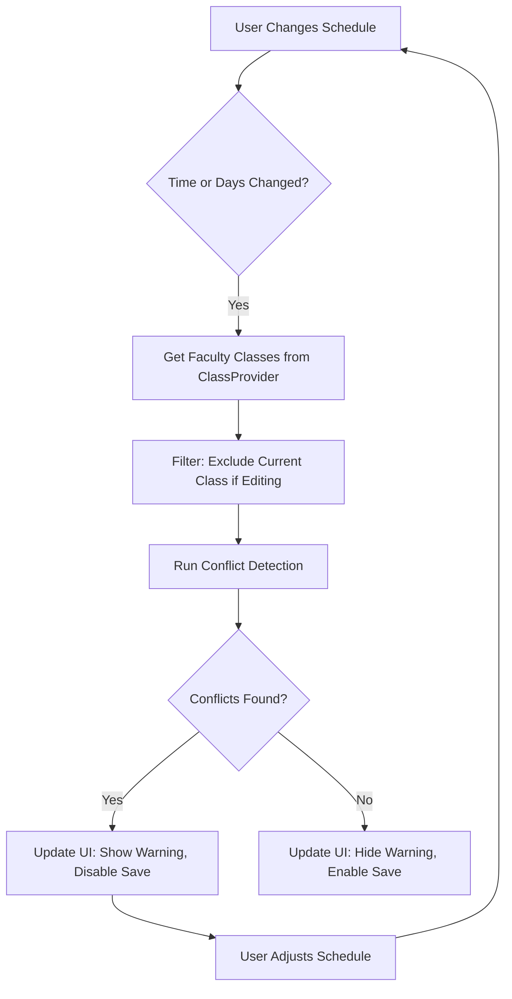

# Design Document: Schedule Conflict Detection

## Overview

This design implements automatic schedule conflict detection for faculty members in EduSync. The system provides real-time feedback when creating or editing classes, preventing faculty from accidentally double-booking their schedule. The implementation leverages the existing `ClassModel.conflictsWith()` method and integrates conflict checking directly into the Add/Edit Class screen.

## Architecture

The conflict detection follows a reactive pattern where any change to the schedule (start time, end time, or days) triggers an immediate conflict check against all existing classes owned by the faculty.



## Components and Interfaces

### 1. ScheduleConflictService

A utility service that handles conflict detection logic.

```dart
class ScheduleConflictService {
  /// Check for conflicts between a proposed schedule and existing classes
  /// Returns a list of conflicting classes
  static List<ClassModel> findConflicts({
    required TimeOfDay startTime,
    required TimeOfDay endTime,
    required List<int> daysOfWeek,
    required List<ClassModel> existingClasses,
    String? excludeClassId, // For editing - exclude the class being edited
  });

  /// Format conflict information for display
  static String formatConflictMessage(List<ClassModel> conflicts);
  
  /// Check if two time ranges overlap
  /// Adjacent times (e.g., 9:00-10:00 and 10:00-11:00) are NOT considered overlapping
  static bool timesOverlap(TimeOfDay startA, TimeOfDay endA, TimeOfDay startB, TimeOfDay endB);
  
  /// Check if two day lists share any common days
  static bool daysOverlap(List<int> daysA, List<int> daysB);
}
```

### 2. AddEditClassScreen Updates

The existing screen will be enhanced with:
- State variable `_conflictingClasses` to track detected conflicts
- Conflict checking on time/day changes
- Warning banner widget
- Save button disabled state based on conflicts

```dart
// New state variables in _AddEditClassScreenState
List<ClassModel> _conflictingClasses = [];
bool _hasScheduleConflict = false;

// New method to check conflicts
void _checkScheduleConflicts() {
  final classProvider = context.read<ClassProvider>();
  final conflicts = ScheduleConflictService.findConflicts(
    startTime: _start,
    endTime: _end,
    daysOfWeek: _days.toList(),
    existingClasses: classProvider.classes,
    excludeClassId: _editingClass?.id,
  );
  setState(() {
    _conflictingClasses = conflicts;
    _hasScheduleConflict = conflicts.isNotEmpty;
  });
}
```

### 3. Conflict Warning Widget

A reusable widget to display conflict information:

```dart
class ScheduleConflictWarning extends StatelessWidget {
  final List<ClassModel> conflicts;
  
  // Displays:
  // - Warning icon and "Schedule Conflict" header
  // - List of conflicting class names with their times
  // - Overlapping days highlighted
}
```

## Data Models

No new data models are required. The existing `ClassModel` already has:
- `daysOfWeek: List<int>` - Days the class occurs (1=Monday, 7=Sunday)
- `startTime: TimeOfDay` - Class start time
- `endTime: TimeOfDay` - Class end time
- `conflictsWith(ClassModel other)` - Existing method for conflict detection

The existing `conflictsWith` method will be leveraged, but we'll also create a service method that works with raw time/day values for checking before a ClassModel is created.

## Correctness Properties

*A property is a characteristic or behavior that should hold true across all valid executions of a system—essentially, a formal statement about what the system should do. Properties serve as the bridge between human-readable specifications and machine-verifiable correctness guarantees.*

### Property 1: Schedule Change Triggers Conflict Check

*For any* change to start time, end time, or days of week in the Add/Edit Class screen, the conflict detector SHALL run and update the conflict state.

**Validates: Requirements 1.1, 1.2, 1.3**

### Property 2: Self-Exclusion When Editing

*For any* class being edited, the conflict detector SHALL NOT report a conflict between the class and itself, even if the schedule remains unchanged.

**Validates: Requirements 1.4**

### Property 3: Warning Content Completeness

*For any* detected conflict, the warning message SHALL contain the conflicting class name, the overlapping day(s), and the time range of the conflicting class.

**Validates: Requirements 2.1, 2.2, 2.4**

### Property 4: No Warning When No Conflict

*For any* schedule that does not overlap with existing classes, the conflict warning SHALL NOT be displayed.

**Validates: Requirements 2.3**

### Property 5: Save Button State Follows Conflict State

*For any* state of the Add/Edit Class screen, the Save button SHALL be disabled if and only if there are unresolved schedule conflicts.

**Validates: Requirements 3.1, 3.3, 3.4**

### Property 6: Conflict Detection Accuracy

*For any* two classes, a conflict SHALL be detected if and only if they share at least one common day AND their time ranges overlap (startA < endB AND endA > startB). Classes on the same day with non-overlapping times (e.g., 9:00-10:00 and 11:00-12:00) SHALL NOT conflict.

**Validates: Requirements 4.1, 4.2**

### Property 7: Adjacent Times Non-Conflicting

*For any* two classes where one ends exactly when the other starts (e.g., 9:00-10:00 and 10:00-11:00) on the same day, they SHALL NOT be considered conflicting.

**Validates: Requirements 4.4**

### Property 8: Same Day Non-Overlapping Times Non-Conflicting

*For any* two classes on the same day where the time ranges do not overlap (e.g., Monday 9:00-10:00 and Monday 2:00-3:00), they SHALL NOT be considered conflicting.

**Validates: Requirements 4.1, 4.2**

### Property 9: User Filtering

*For any* conflict check, only classes owned by the current faculty user SHALL be considered.

**Validates: Requirements 4.3**

### Property 10: Student Conflict Warning Allows Join

*For any* student joining a class that conflicts with their enrolled classes, the system SHALL display a warning but still allow the join operation to complete.

**Validates: Requirements 5.1, 5.2, 5.3**

## Error Handling

| Error Scenario | Handling Strategy |
|----------------|-------------------|
| ClassProvider not available | Gracefully skip conflict check, allow save |
| Empty class list | No conflicts possible, allow save |
| Invalid time (start >= end) | Existing validation handles this separately |
| Network error loading classes | Use locally cached classes for conflict check |

## Testing Strategy

### Unit Tests

1. **ScheduleConflictService.timesOverlap()**
   - Test overlapping times
   - Test non-overlapping times
   - Test adjacent times (edge case)
   - Test same start/end times

2. **ScheduleConflictService.daysOverlap()**
   - Test overlapping days
   - Test non-overlapping days
   - Test single day overlap

3. **ScheduleConflictService.findConflicts()**
   - Test with no existing classes
   - Test with one conflicting class
   - Test with multiple conflicting classes
   - Test with excludeClassId (editing scenario)

### Property-Based Tests

Property-based tests will use the `fast_check` or equivalent Dart PBT library to verify:

1. **Conflict Detection Symmetry**: If class A conflicts with class B, then class B conflicts with class A
2. **Self-Conflict**: A class always conflicts with an identical copy of itself (unless excluded)
3. **Adjacent Non-Conflict**: Classes with adjacent times never conflict
4. **Day Independence**: Classes on completely different days never conflict regardless of time

### Integration Tests

1. Test conflict detection triggers on time picker changes
2. Test warning banner appears/disappears correctly
3. Test save button enable/disable state
4. Test editing a class doesn't conflict with itself
